# Setting up a new project

You’re official.  The ink is just drying on your new venture.  Welcome.  The journey is the best part.
Beginning your journey, you will start here.  The category at the top of the far left black bar.  In this example, it reads “Leantime Project”.  This category will be the name of the project you are working on in the system.  
To create a new project, click: Create New Project.

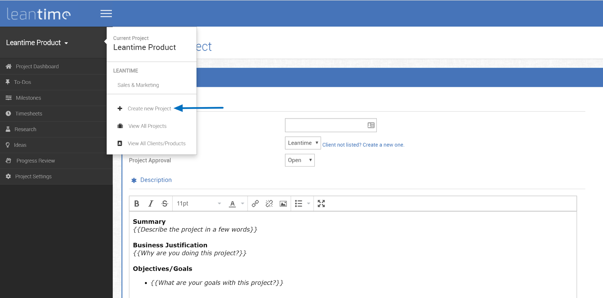

As seen here, your next stop will be on the New Project screen.  Here you will lay out the highlights of the project.  You’ll select the team members, name of the project, the client that the project is for (more on that *here) and the status of the project.  In the large text box, you will summarize the project, explain why the business is doing this with the business justifications and then write down the overarching objectives and goals of the project.

The team members selected here will have access to the tasks and project details.  Farther in on your project creation (here), you’ll be able to assign those tasks to your project members.

All done?  Click Save.

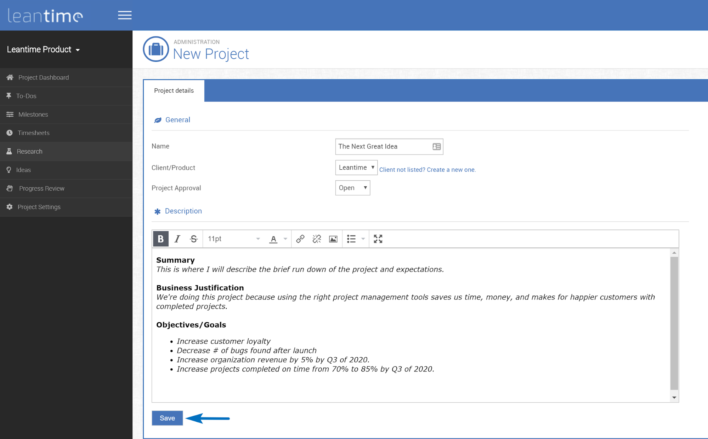

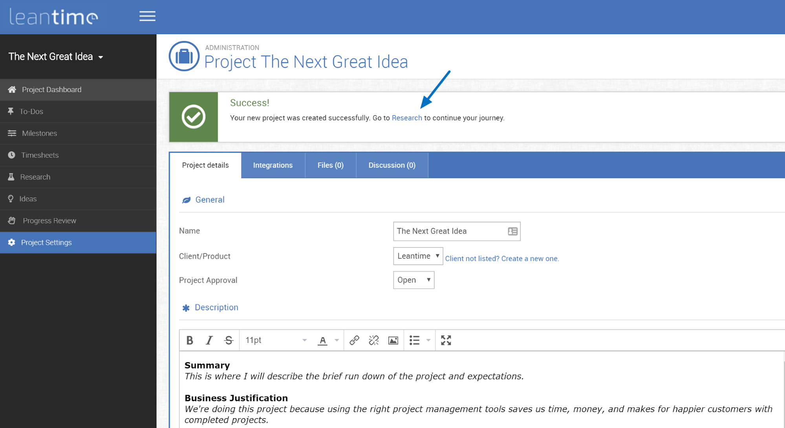
 

Woohoo!  You did it!  You’re on to your Next Great Idea.  Click Research to continue on to the Research Board.

## Research Boards

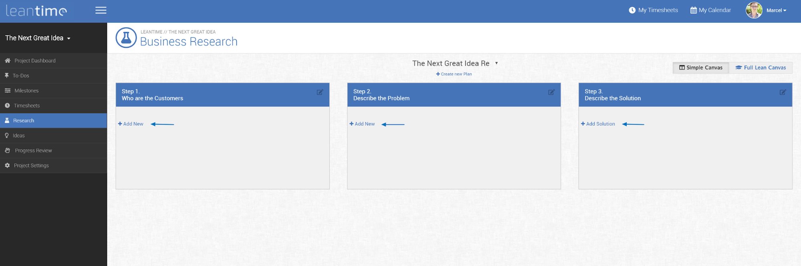

The Research Board is your next stop on the project journey.  There are two views here on the top right side of the boxes - the simple and the full Lean Canvas.  The highlighted text shows which board you are on.  This is the Simple View.  

This view is geared towards those ideas or projects that need some validation or proofing before and/or while tackling tasks.  It asks 3 primary questions.

1. Who am I building for?
2. What Problems do they have?
3. What are my solutions to this problem?

Click Add New

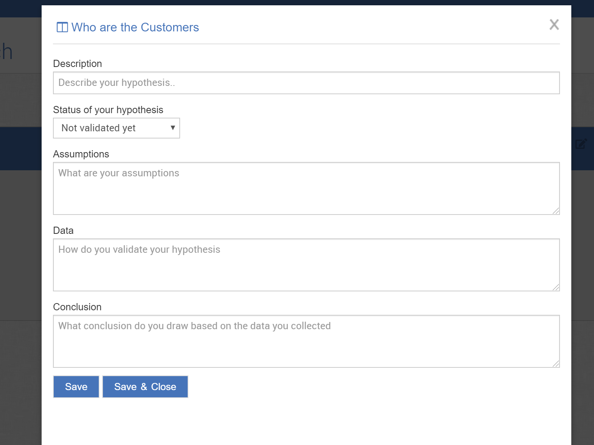

Adding a new customer will show you this screen.  This is where you put all the things you think you know about the customer.  You’ll

1. Describe the Hypothesis about your customer --
Ex:  Entrepreneurs (customer) want to spend more time building their projects.

2. Status of my hypothesis; Not Validated, Validated and False, Validated & True.

3. Assumptions:  We’re assuming that
    - Entrepreneurs feel like they do not have enough time to build projects.
    - Entrepreneurs want to spend more time on projects because it saves money.
    - Entrepreneurs find building more enjoyable than planning.

4. Data Collection:  How will you validate your hypothesis and assumptions?
    - Our team will interview 15 entrepreneur/business owners utilizing open ended questions on their experiences with project management. 

While we typically think we know what a solution should look like, this method of research intends for the customer to share pieces of the solution.  By collecting these data points, you can get the information needed to both validate (or invalidate) your solution and set your team up for building what your customers are looking for and already waiting for.  

This pattern will continue into Problem & Solution.  The Full Canvas will take you through this in more detail -- looking also at solution costs, revenue flows, value proposition, metrics and distribution channels.

In the end, it should look something like this:

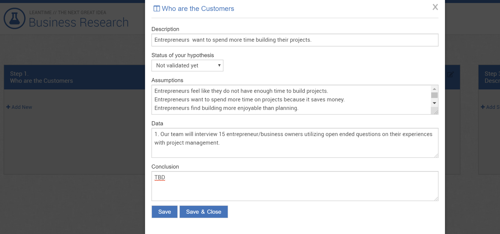

Click Save.

Need more information on the Lean methodologies and research? Click [here](knowledge-base/whatislean.md) to read more.   

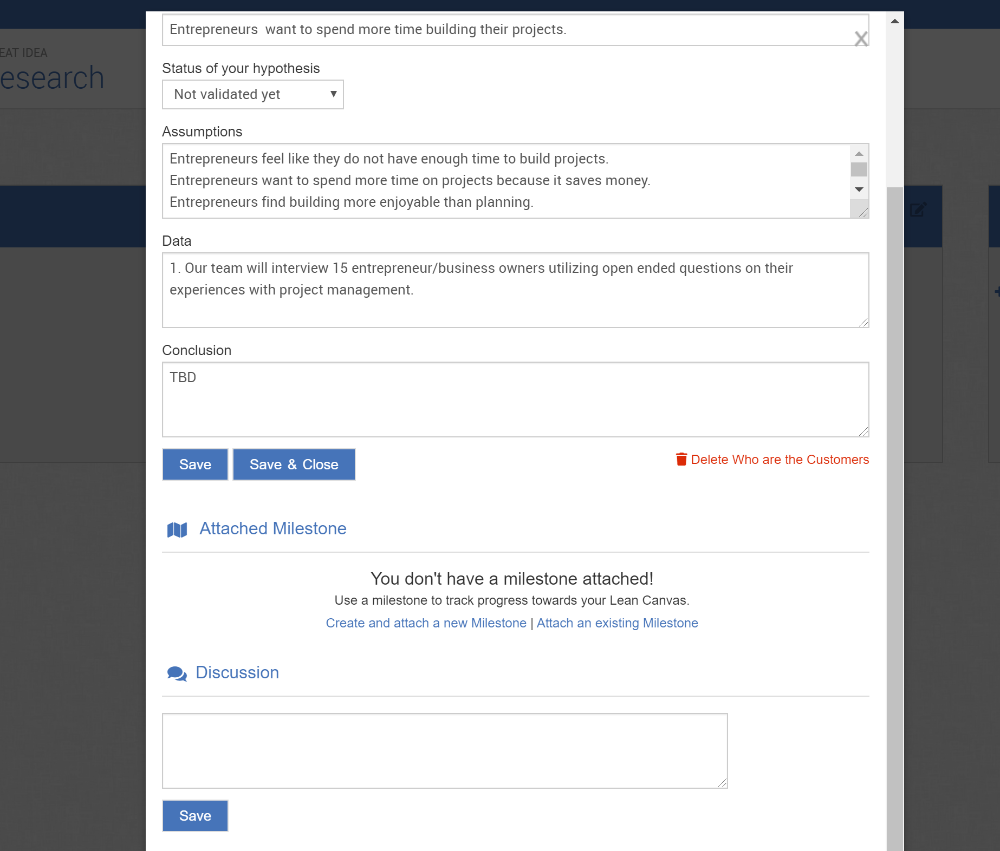

Once you’ve saved your Customer, Problem, and Solution, you’re going to have two options.  Milestones or Discussions.  Discussions are for team members to leave notes and thoughts about the research.  Milestones are the roadmap to your successful project.

When we have our solution, often times our natural inclination is to run straight to the To Do’s portion of our planning.  Don’t do it.  Now that you know what the end should look like, you need to know what on the way looks like.  Progress can get blurred and buried when we can’t track where we are

Since we don’t have any Milestones just yet, let’s click Create & Attach a New Milestone. This will open a blank text box.  Add a milestone.  Click Save.  (Not sure what a milestone should look like?  Click here).

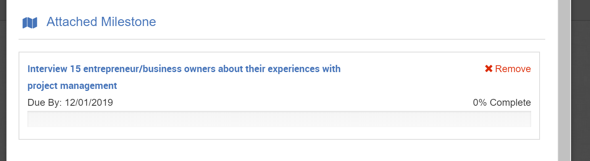

When you’re finished, it’ll look like this:

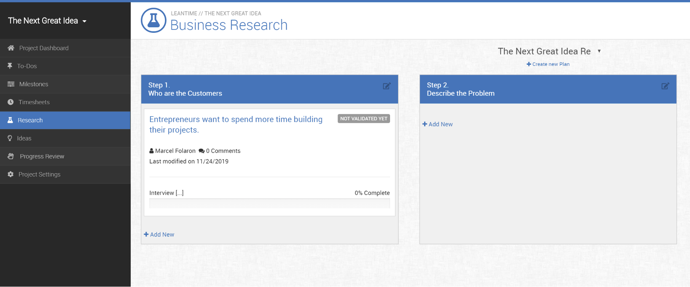

And if you want to dig into the Full Canvas, it’ll look like this:  

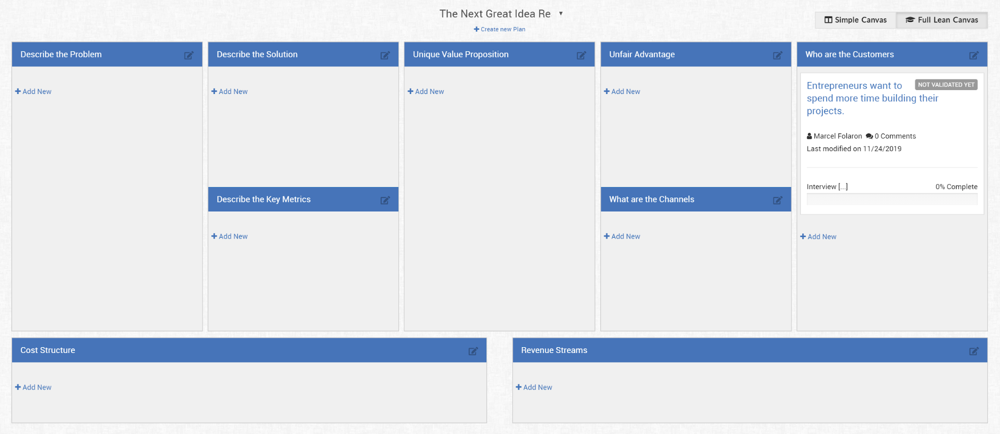

#### Milestones
Remember all the milestones you plugged in already?  This is where you can add your ideas to them.  Not all ideas will need to be attached to a milestone but as they relate to your projects, may cause changes, or simply as you have ideas about project planning -- this will be the place to plug in. If you don't have any milestones set up, you can create a new one from this screen in the same way you would have from the research board.

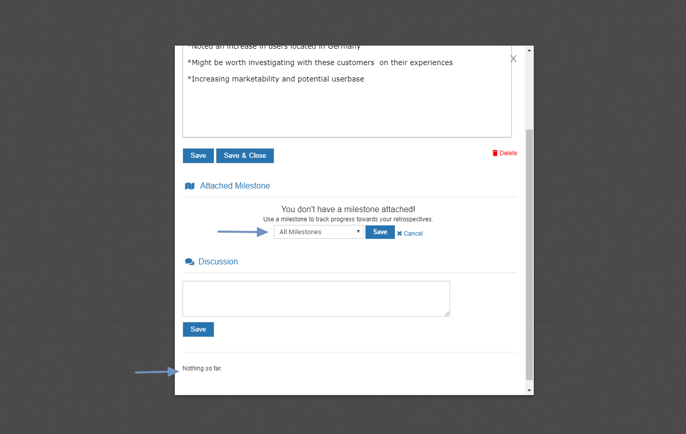

To add an existing milestone, click on the *Attach an Existing Milestone* button and the above screen will come up.  You might also notice that there
is text on the bottom of the screen that reads, "Nothing so far".  This is just to let you know that there is no discussion on this idea currently.

#### Idea Wall

Once you've saved all the relevant pieces to that initial idea and *Close* the tab, your Idea board will default to the Idea Wall view.  It looks like this: 

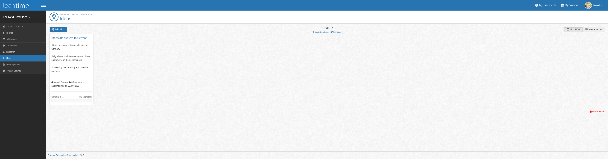

#### Idea Kanban

This is the location for your working ideas (or the resting place for the ones on hold).  Similar to the the traditional kanban for task management, you will 
see that you have 6 boxes that your ideas can sit under.

To move an idea between boxes, simply click it and drag it to the appropriate category.

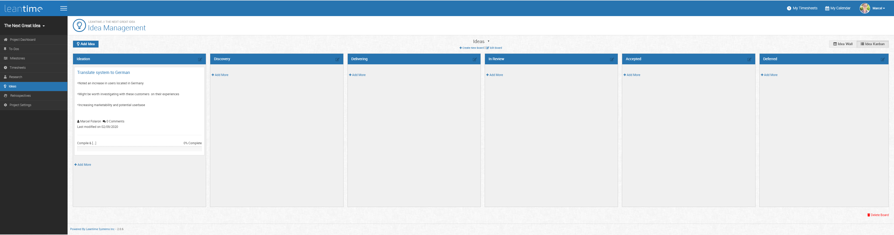

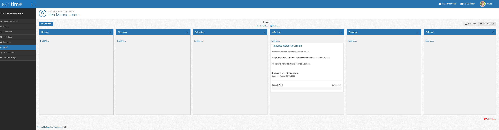

Now it's time to come up with the next great idea.  Click [here](knowledge-base/idea-management.md) to read more on Idea Management.

## Milestones

Getting started with milestones will be a little easier to envision now that you’ve started with one from the Research board.  

The gray bar here shows that this milestone is expected to last from March to August.  This is in the Month view.  There are also Day and Week views for those times that you need to fine tune / be more specific.  

You can then adjust the length of time frame by dragging the side of the gray bar out or in.  Then you can place the gray bar along the screen to a new timeline as below (moving from March to August to March to April):

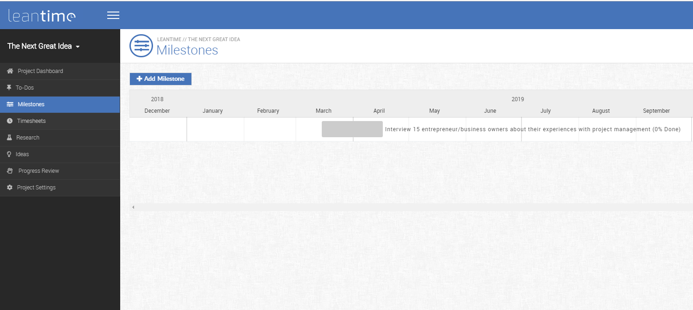

Adding a New Milestone can be done by clicking the blue button on the top of your Milestones board.  Doing this will open up a new window.  Selecting the dates in the New Milestone box will allow you to place the box on the specified dates on the timeline screen.  Click save.

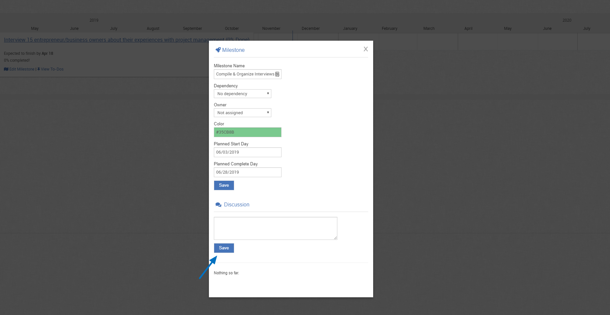

Needing to make a change to your milestones?  Click on the text of that milestone.  A new box will pop up.  

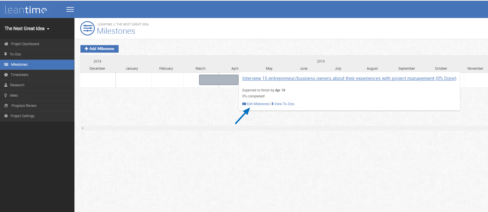

In this view, you can then edit the milestone or click over to the To Do / Kanban view of your project.  Editing milestones will look just like the Add New screen.

If your new milestone depends on another milestone finishing before you can press on, you can add that on in the Add New or Edit Milestone screen.  Click the “Dependency” drop down and select the milestone it depends on.  The result will be a line attached to both milestones.  In this case, the green milestone is dependent on the gray one.

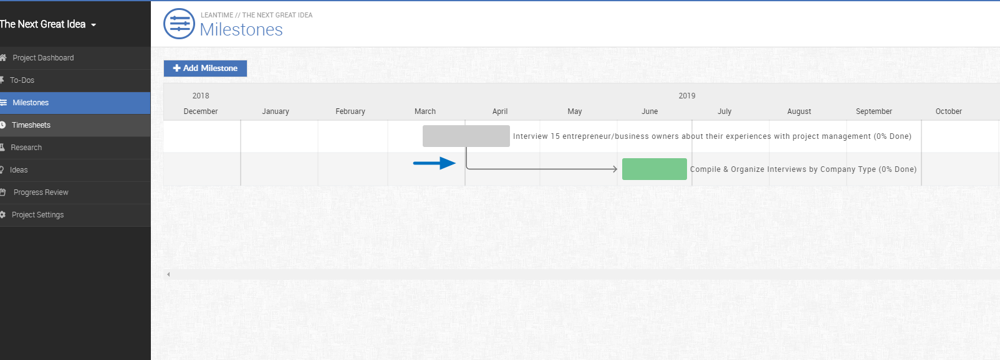

From the milestone screen you can move to the doing portion of your Project.  Select View To Dos.

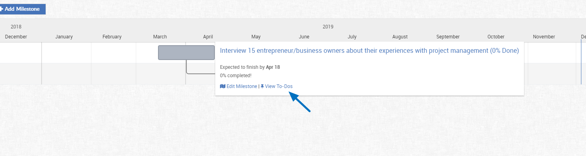

## To-Dos

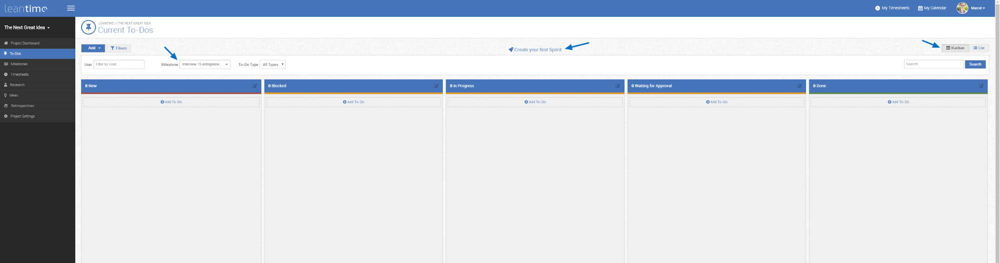

On the To Do screen, you’ll be able to attach actions to a milestone, start a sprint, change views from Kanban to List format.

 If you’ve already added in milestones, this screen will also pre-populate with the filters on.  To move away from the milestone related To Dos, you’ll click the drop down on the left hand side with the arrow on it.  You can then select All Milestones.  This will make that bar disappear.  To bring it back, select Filters.

You’ll also have the ability to add specific To Dos and quickly get an overview of where you, or your teammates, are with their work efforts.

The List View offers the same options but in a different viewing format.  This is a Backlog view if you’re used to SCRUM.

## Start a Sprint

From the To Do screen, click on the upper top text that says, “Start A Sprint.” From there, this screen will pop up: 

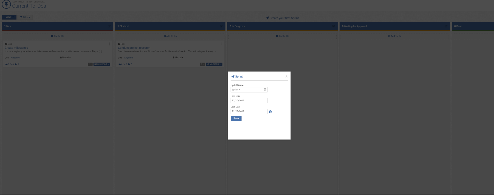

Fill it out, click save:

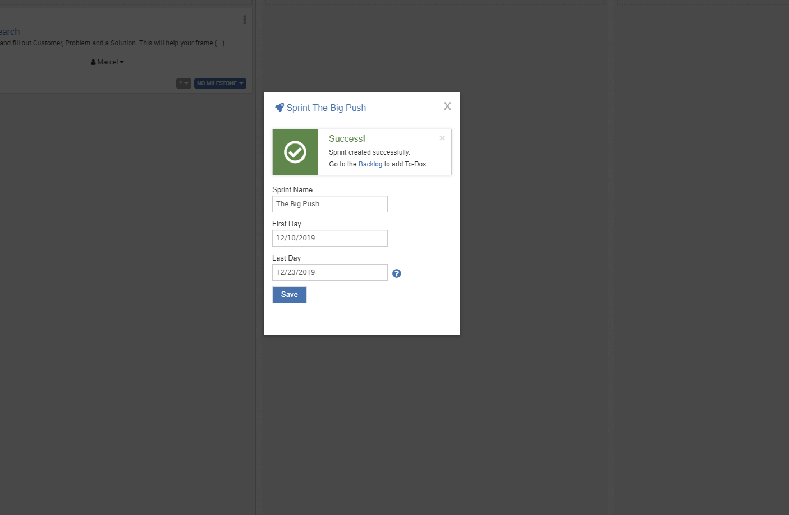

You can click the Backlog here or click into the gray area of the screen to stay in the Kanban view.  You can then add To-Dos for this Sprint in either view.

If you choose to stay in the Kanban view, you’ll default to the original to do box:

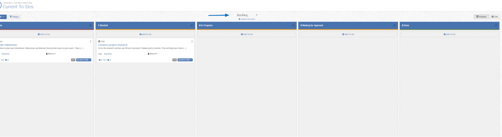

Click the pull down at the arrow to switch to the new Sprint. 

Click into the Sprint - in this case, it’s called The Big Push.  The Title of the Sprint will now show the dates of the sprint underneath.  Now I can go back and add more To Dos.

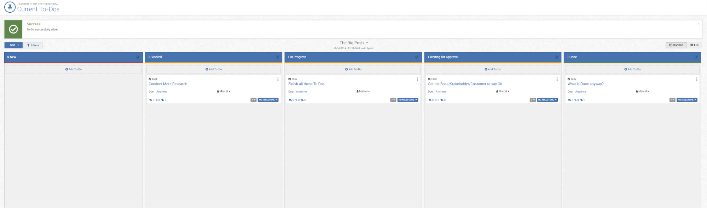

Adding a To Do is on the top left corner of this working window.  See the arrow.  Here you can also add a new milestone and sprint.

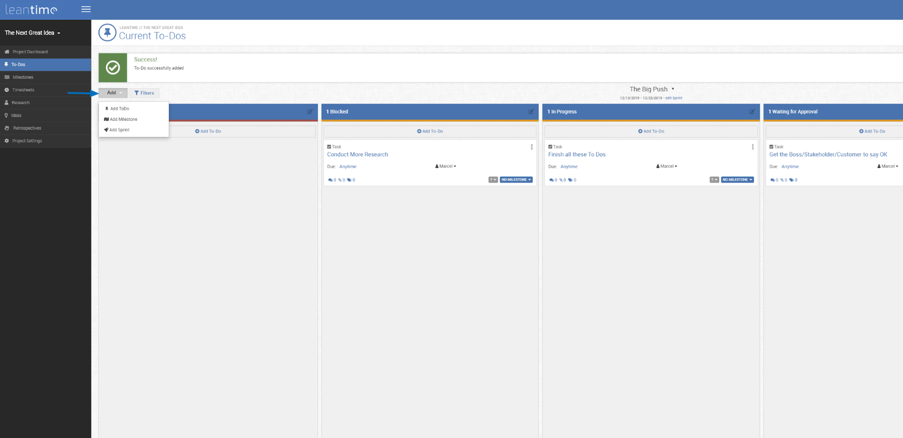

There are two types of To-Dos you can add.  There is a full detailed one and a short text version.  When you click Add New To Do at this drop down, you’ll load a full detailed version.  

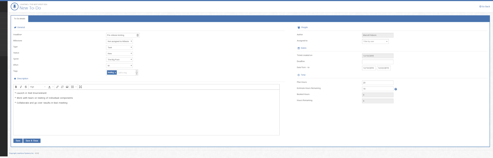

Headline: Title of the To Do
Milestone: This one is not assigned to any but you can select from previously made.
Type: This is a Task, Story, or Bug.
Status: This is the category box on the Kanban that it’ll be in
Sprint: The push we’re in
Effort: The amount of work we suspect it’ll take (S, M, L, XL, XXL)
Tags: Key words associated with this type of to do.

Click Save & Close when finished.

# Retrospectives

Retrospectives are that important end piece to every Sprint and even great for the end of a milestone or project completion. This is that final meeting to talk about what went well, what didn't go so well, and what to change.  You can focus on all dimensions of a project 
and can include things such as: communication, delivery, planning, and workflow.

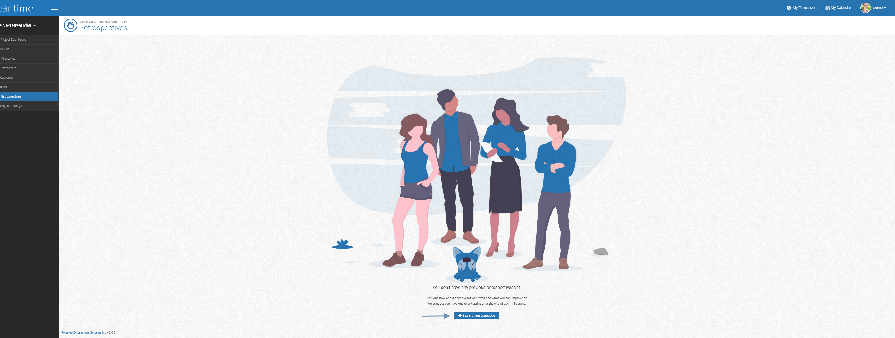

The screen above is the first screen you will see the first time you go to start a retrospective in every project. Click *Start a Retrospective*.
 
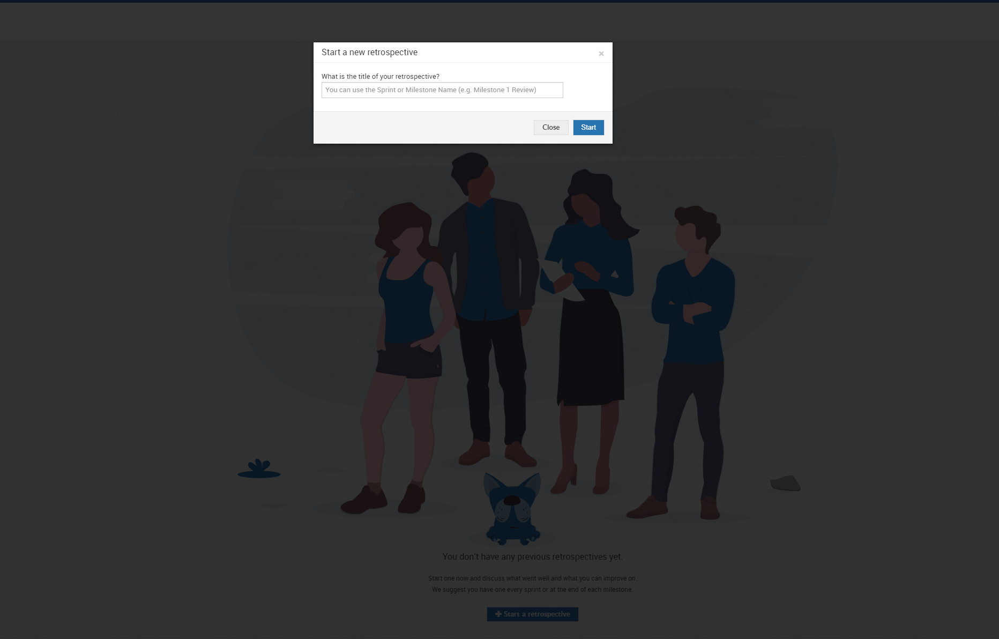

From there, another pop up box will appear and ask you for the title of your Retrospective.  In this case, we continued the title from this sample project, "The Next Great Idea" but in reality, you could use a Sprint name, Dates, Milestones, or as this, a project name.   Click *Start*.
 

Here you'll see 5 button options.

**Add More**  
**Board Title**:  This drop down menu allows you to select which board you are working on.  
**Create New Board**: As stated, start a new one. 
**Edit Board**: This lets you modify the title of the board. 
**Delete Board**

Click *Add More*.
 
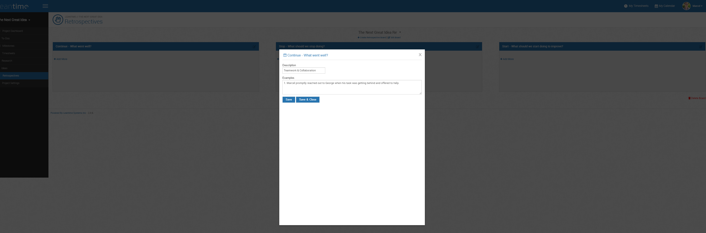

Adding More allows you to edit the title and place examples of what went well.  From this screen, you can also create a new milestone or attach to an existing one.  In this case, we've added an existing milestone.  Click *Save & Close*

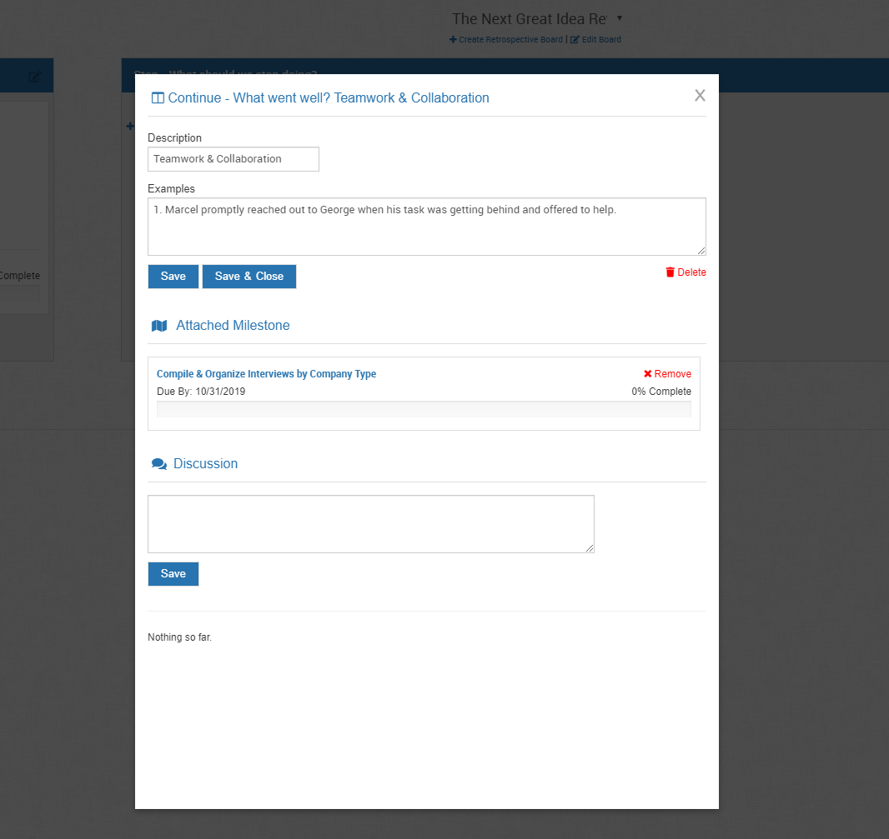

Clicking *Save & Close* on the previous screen will take you back to the main board view.  Complete the remaining sections and you'll be ready to review how things went. 

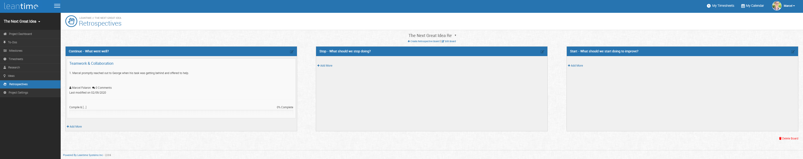
 
 Retrospectives can be a quick and effective way to boost team morale, work together, and find ways to always improve. Click [here](knowledge-base/team-happiness.md) to read more on Team Happiness.

