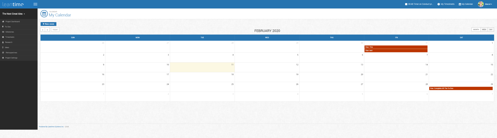
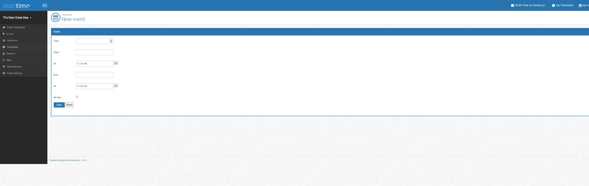

# Calendars 

Wanting to plan your work and deadlines?  The My Calendar function allows you to create dates, deadlines, and plan for work tasks.  
To get to this screen, click My Calendar on the top right hand corner next to your account profile.

Click New Event to add a new input to your calendar.

  
 
   
  
