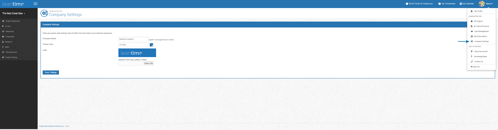

# Company Settings

To find and edit the company settings page, click on your profile image on the top right corner.  This drop down will bring down Company Settings.  

Company settings will allow you to set the header in your screen and emails.  It'll allow you to pick your theme colors and upload logos to show on the top left corner.

  
 
## Telemetry

Telemetry data optionally shared from your Leantime servers is used to identify help improve the quality of Leantime software and related services, and to make design decisions for future releases.

Telemetry data is encrypted in transit, does not include personally identifiable information or message contents, and details of how the information is used and processed is available here.

The data we collect is anonymized and only contains aggregate data from your instance. The data we collect is:
* date - the date of the collection
* companyId - A UUID for this instance. 
* version - The current leantime version
* language - The language as set in the config file
* numUsers - The number of users
* lastUserLogin - The last login of any user
* numProjects - The total number of projects
* numClients - Total number of clients
* numComments - Total number of comments
* numMilestones - Total number of milestones
* numTickets - Total number of To-Dos
* numBoards - Total number of boards across ideas, retrospectives & research boards
* numIdeaItems - Total number of ideas across all boards
* numResearchItems - Total number of cards in research boards
* numRetroItems - Total number of cards in retrospective boards
* numHoursBooked - Total number of hours booked in timesheets

We do not collect any personal identifieble information or anything that would allow us to identify the company using leantime (not even company name).
IP addresses, locations or any other server information that might be sent is also not stored anywhere.

To opt out of telemetry you can uncheck the "Help make Leantime better" checkbox. This will disable the telemetry submission and remove your unique instance id. 

We appreciate your support in helping us!
