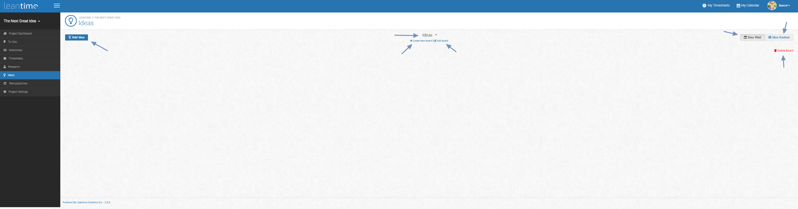
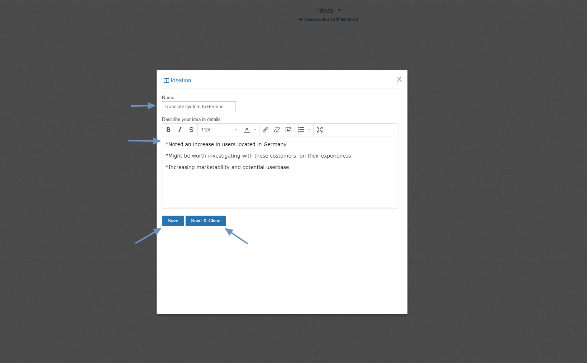
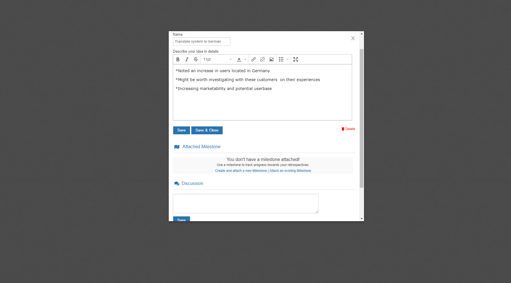

# Idea Management

Project life is dynamic.  While you're building one thing, you are likely working on another piece of it.  The Idea Wall & Idea Kanban in Leantime is set up in order
for the team to share, track, and implement ideas in the full product lifecycle.  

When you first open up the board, your screen should look like this:

Here you'll see 7 button options.

**Add Idea**  
**Board Title**:  This drop down menu allows you to select which board you are working on.  
**Create New Board**: As stated, start a new one. 
**Edit Board**: This lets you modify the title of the board. 
**Idea Wall**: is the primary view that simply shows ideas.  
**Idea Kanban**: is the workable idea board view; quickly see the status of your ideas 
**Delete Board**

Click *Add Idea* to get started:

On a new Idea screen, you'll find a place to name the idea, a description area and a Save and a Save & Close button.

When you click *Save*, you'll move to this screen:

#### Milestones
Remember all the milestones you plugged in already?  This is where you can add your ideas to them.  Not all ideas will need to be attached to a milestone
but as they relate to your projects, may cause changes, or simply as you have ideas about project planning -- this will be the place to plug in.
If you don't have any milestones set up, you can create a new one from this screen in the same way you would have from the research board.

To add an existing milestone, click on the *Attach an Existing Milestone* button and the above screen will come up.  You might also notice that there
is text on the bottom of the screen that reads, "Nothing so far".  This is just to let you know that there is no discussion on this idea currently.

#### Idea Wall

Once you've saved all the relevant pieces to that initial idea and *Close* the tab, your Idea board will default to the Idea Wall view.  It looks like this: 

#### Idea Kanban

This is the location for your working ideas (or the resting place for the ones on hold).  Similar to the the traditional kanban for task management, you will 
see that you have 6 boxes that your ideas can sit under.

To move an idea between boxes, simply click it and drag it to the appropriate category.

Now it's time to come up with the next great idea.  Click [here](knowledge-base/idea-management.md) to read more on Idea Management.
