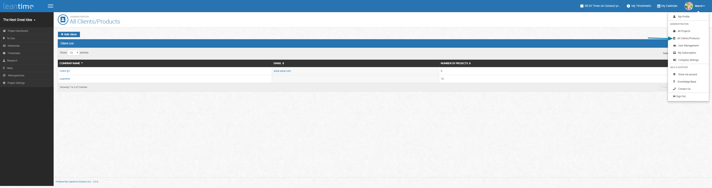
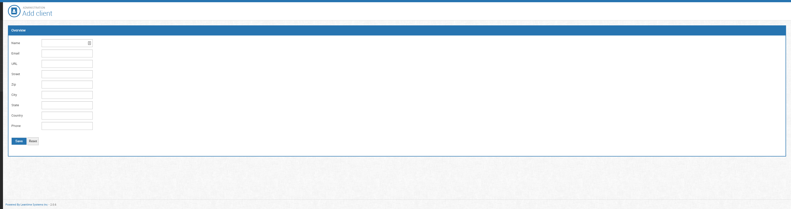

# Managing Clients

Managing clients can be found in the drop down from your account profile name on the top right corner.  Click Managing Clients.

On that screen, you'll see emails and names of clients with numbers of projects.  You can click into the client information by clicking the blue text or you can add a 
new client by clicking Add New.

  
 
   
  

