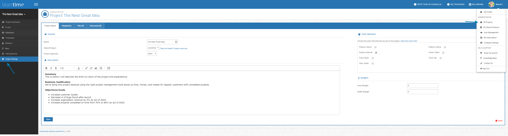
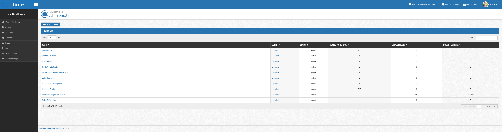

# Managing Projects

In order to manage projects, you can find two separate views.  You have an option for Project Settings -- this view allows you to edit the details of the current
project that you are on.  You can also view all projects by clicking on the drop down next to your account information and select All Projects.

  
 
 This is the all project view.  From here, you can create new projects or edit others.  
 
   