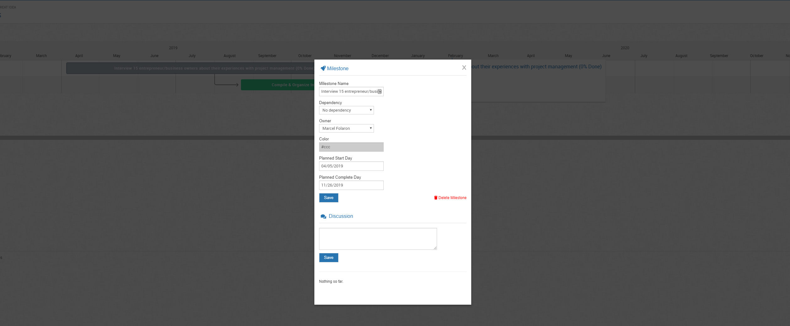
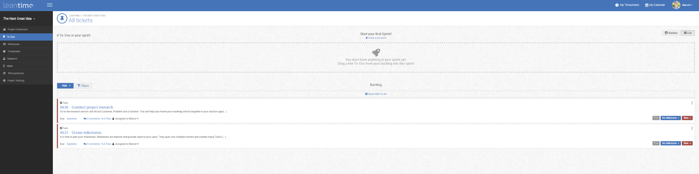
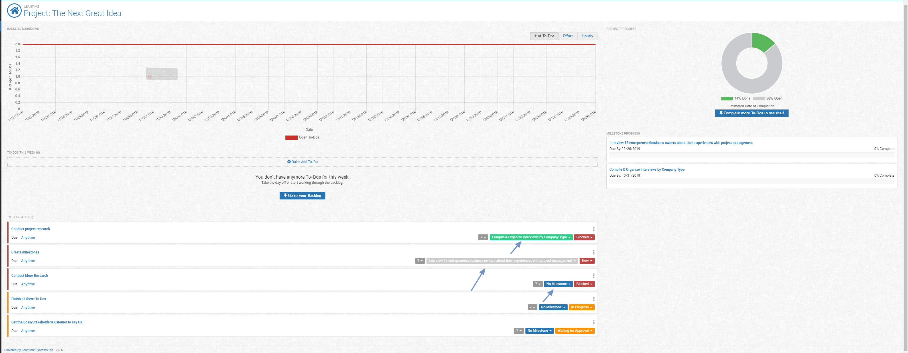

# Roadmap Planning or Milestone Management

In Leantime, we've made milestones innate to your task management.  Now you have a view that shows you where your tasks are in your timeline.      
 
  ##Milestone View
 
 
 
 ##Edit Milestones
 
 To edit your milestone after it's already been added, click the milestone title and a box will show.  Click Edit Milestone.
 
 
 
 This is the milestone edit screen.  From here, you can modify the name, if the milestone is dependent on an item, the owner,
 the color and start and stop days.
 
 
 
 When a milestone has a dependency, it shows like this: 
 
  
  
 A dependency shows that one milestone must finish before another one can be considered complete.  In this scenario, before the green milestone "Compile and Organize"
 can finish, the milestone "Interview 15 entrepreneur/business owners" must finish first.  

 ####Extend the Dates / Timelines of Milestones
 
 While you can make these edits from the "edit milestone" portion of the screen, you can also quickly edit timeframes from the primary view. 
 In this image below, the dates are set from mid March to mid April. 
 
 
 
  You can click the ends of this date time frame and extend it farther out as in below.  The new timeline here is extended from March to August.  
 
 
 
  ##Task Management & Milestone Views
 
Within the highlighted milestone, you can quick link to the To Dos Kanban Board by clicking "View To Dos"
 
  
  
 From the To Do screen, you can sort your tasks by Milestone by clicking the milestone drop down on the left upper portion of your kanban board.
  
  
   
   From the adding a "To Do" screen, you can attach the to do directly to the milestone within this screen.  It's visible here under the "Headline" drop down.
   
  
  
  Then again, from the Kanban view -- you can switch over to the Backlog (the location of all the to dos) and add and change a to do's milestone.  You will see this 
  type of modifier throughout the system in places like this and on the Project Dashboard. 
 
 
 
 ##Other Screens to Access & Modify Milestones
 
 ####Research Boards
 
 Depending on where you are in your project journey, when you start at the Research boards (or go back to them), you will have the ability to create and attach
 current milestones to your research concepts.  Seen on the image below.
 
 
 
 ####Project Dashboard
 
  
  
  ####Idea Management & Retrospectives
  
  Both these boards also have the ability to edit/add/modify milestones directly within them.
 

