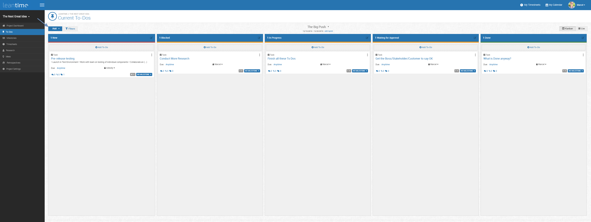
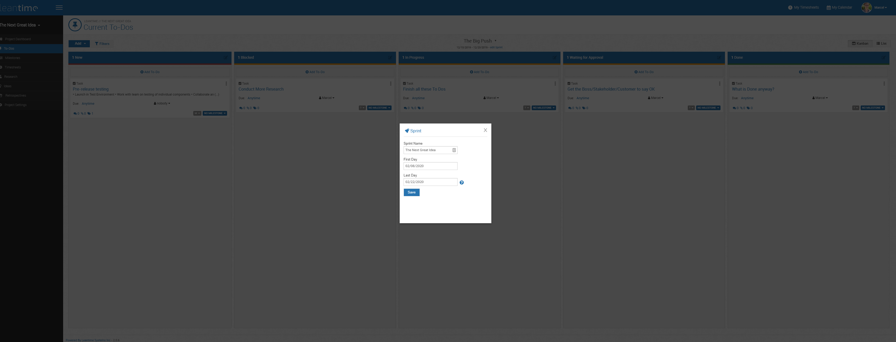
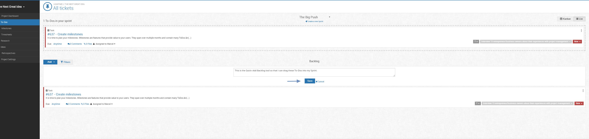
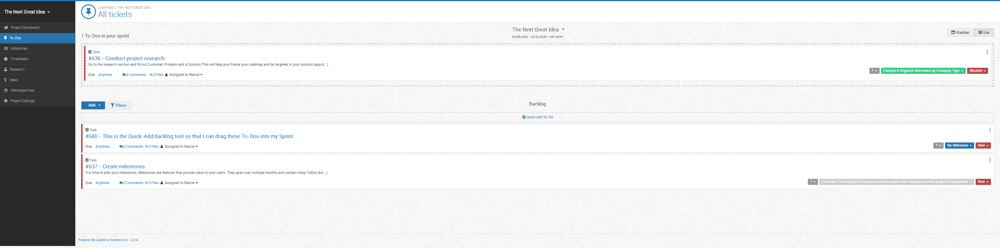
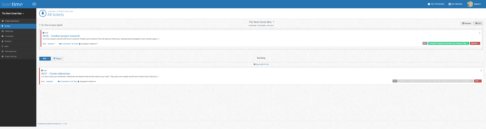
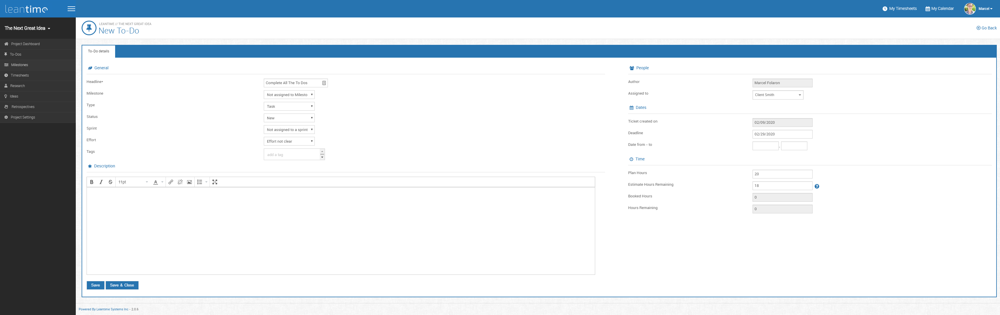
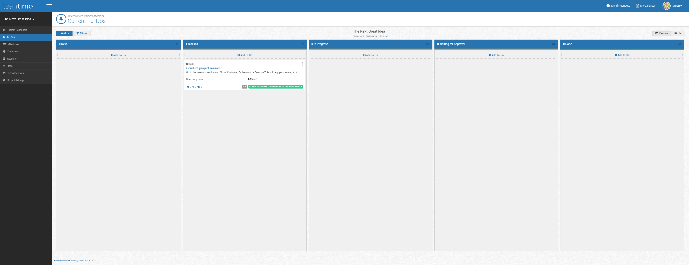
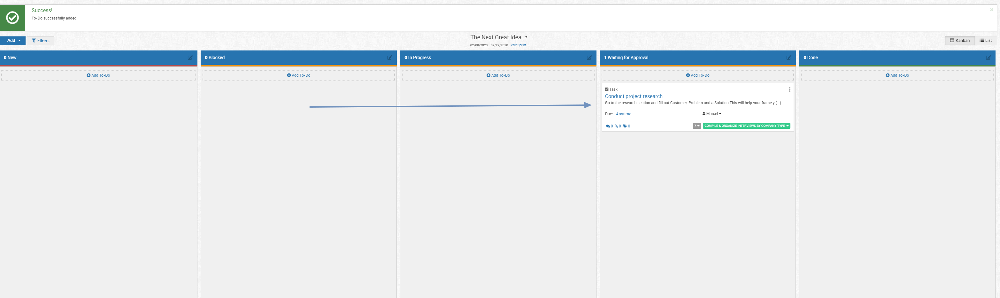
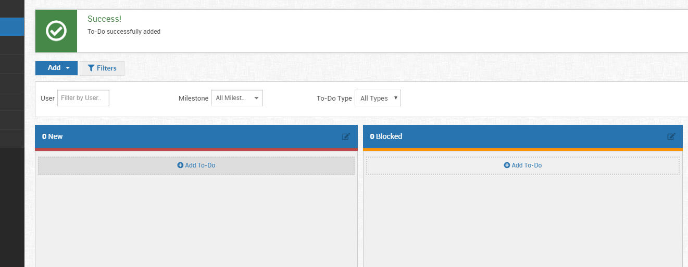

# Task Management

Task management (or your To Do boards) may likely be where you spend most of your time.  Staying organized here is important -- these are the fine details
that can make or break a project or release cycle.

In this area, you have two main management routes:  Backlog or Kanban board.  A kanban view is essentially a quick status view of where work is; whether it's 
in progress, blocked, new, or done.  The backlog view is where you house all the tasks -- the ones you're currently working on and the ones waiting to be worked on.
In that view, you will be able to start and set tasks for your Sprints.  

## Sprints

Sprints are, as they sound, quick bursts of work done with the goal of having a releasable iteration of work at the end of the time period.  When you've broken
large concept projects into the whole project, to milestones, and to sprints -- you've taken a big idea and made it simpler, manageable and in workable chunks.   

 
 
 This is our To Do screen.  It currently shows that we are on the Sprint "The Big Push" and has a timeline underneath the title.  That date has gone and passed
 so we're ready to add a new one.  We'll click *Add* and then select *Add Sprint* to do so.  Clicking *Add* also allows you to add a milestone or a To Do.
 
  
  
  Clicking *Add* brings up a new Sprint screen.  Here you'll set a title and timeframe.  Click *Save*.
  
 
 
 Once you click save, a new "Saved!" box will pop up.  It will direct you to the Backlog view so that you can drag and drop your tasks into the current Sprint.  
 Again, this backlog view is the home for all tasks.  You can either move a ready made task into the Sprint or quick-add a new one from this screen as seen below.
 
 ## Backlog
 
  
  
  
 
 
 
 From the backlog screen and from the Kanbann view, you can also click the blue button of *Add*, this will allow you to add a more detailed To Do or Milestone.
 That To Do screen will look like this.
 
  
 
 When you've finished in the backlog view, click *Kanban* to go back to the board view.  From here, to move a task into a new category, you'll simply click and drag.
 
 
 
 

## Filters
 
This example is very simple.  As your tasks and milestones increase for your projects, you may want to filter tasks and activities by user working on them,
by milestone, or by To Do type (task, bug, story).  
 
 
 
## Time Tracking
 
From the main Kanban view, you can click on the 3 dots on the top right corner of your task/to do box.  This will pull up the options to edit, delete or Start Work.  
Starting work will start a task timer that allows you to track the time spent on that effort and input it into your timesheet.
 
  
  
  Starting work will start a timer on the top of your screen next to *My Timesheet*.  Time is not tracked if work spent is less than 6 minutes long.
  
  
  
  
 
Click [here](knowledge-base/agile.md) to read more on agile and then over [here](knowledge-base/task-management.md) to read more on Task Management.
   
