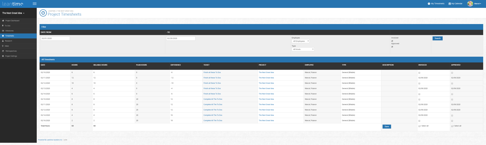
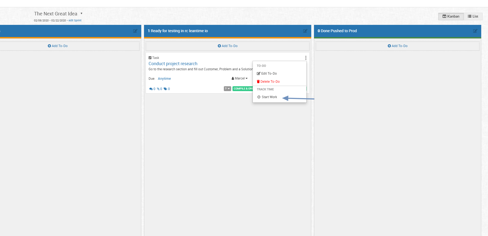
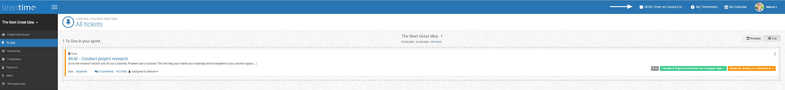
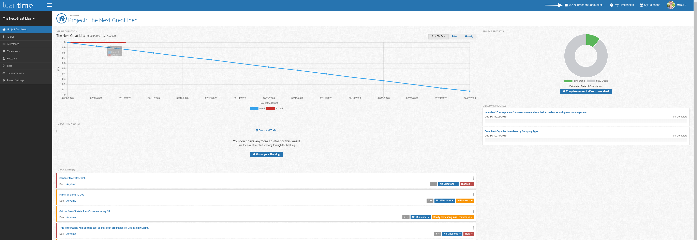

# Time Sheets

Timesheets has two primary views: *My Timesheets* and *Timesheets*.

My timesheets are seen below in the top right corner.  This is the space where you can enter in 

 
 
  
  
 ####Time Tracking
 
From the main Kanban view, you can click on the 3 dots on the top right corner of your task/to do box.  This will pull up the options to edit, delete or Start Work.  
Starting work will start a task timer that allows you to track the time spent on that effort and input it into your timesheet.
 
  
  
  Starting work will start a timer on the top of your screen next to *My Timesheet*.  Time is not tracked if work spent is less than 6 minutes long.
  
  
  
  Here's what it'll look like when you start time.
  
    
     
