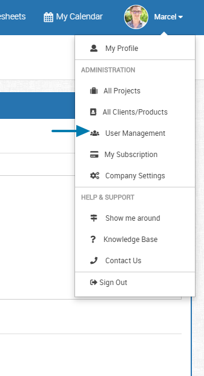
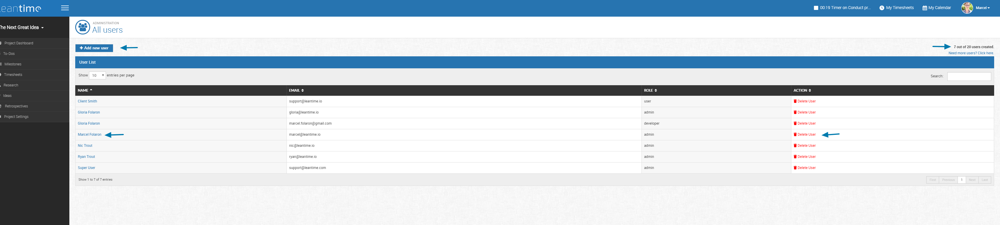

# User Management

## Adding Users

In User Management, you can add new team members, clients or other roles that you may need to give access to their projects.  To get to the User Management role, you will
click on the drop down next to your name/account information.  *Click User Management*

  
 
 In the User Management screen, you'll see the names of the individuals on your projects, their email, role, and have the ability to delete.  As part of our
 subscription, you will also see on the top right the amount of roles you have left in your subscription plan.  
 
 Clicking into a person's name will allow you to edit their profile or you can click Add User to create a new one.
   
  
 
 In this example, we've clicked on Marcel's name.  In his view, you can change his name, role, email, and you can select the projects that he's assigned to.
 Click on the project name and the arrow to assign which side that project is on.  The left side shows the projects that can be assigned and the right side
 shows the projects actually assigned to the user.
      
 ## Roles
 
 You can has 5 different user roles that can be assigned globally per user or on a per project basis.
 Admins and Owners cannot be overwritten by project roles. 

Feature | Owner | Admin | Manager | Editor | Commenter | Read-Only
-- | -- | -- | -- | -- | -- | --
  |   |   |   |   |   |  
ToDos |   |   |   |   |   |  
View Todos | x | x | x | x | x | x
Create | x | x | x | x |   |  
Edit Todos | x | x | x | x |   |  
Delete Todos | x | x | x | x |   |  
Comment | x | x | x | x | x |  
File Upload | x | x | x | x | x |  
  |   |   |   |   |   |  
Ideas |   |   |   |   |   |  
View | x | x | x | x | x | x
Create | x | x | x | x |   |  
Edit | x | x | x | x |   |  
Delete | x | x | x | x |   |  
Comment | x | x | x | x | x |  
File Upload | x | x | x | x | x |  
  |   |   |   |   |   |  
Research |   |   |   |   |   |  
View | x | x | x | x | x | x
Create | x | x | x | x |   |  
Edit | x | x | x | x |   |  
Delete | x | x | x | x |   |  
Comment | x | x | x | x | x |  
File Upload | x | x | x | x | x |  
  |   |   |   |   |   |  
Timesheets |   |   |   |   |   |  
View | x | x | x | x |   |  
Create | x | x | x | x |   |  
Edit | x | x | x | x |   |  
Delete | x | x | x | x |   |  
Comment | x | x | x | x |   |  
File Upload | x | x | x | x |   |  
  |   |   |   |   |   |  
Projects |   |   |   |   |   |  
View/settings | x | x | x |   |   |  
Create | x | x | x |   |   |  
Edit | x | x | x |   |   |  
Delete | x | x | x |   |   |  
Comment | x | x | x |   |   |  
File Upload | x | x | x |   |   |  
Assign | x | x | x |   |   |  
  |   |   |   |   |   |  
Users |   |   |   |   |   |  
View Profiles | x | x | x | x | x | x
View All | x | x |   |   |   |  
Create | x | x |   |   |   |  
Edit | x | x |   |   |   |  
Delete | x | x |   |   |   |  
Comment | x | x | x | x | x |  
File Upload | x | x | x | x | x |  
Assign to project | x | x | x |   |   |  
  |   |   |   |   |   |  
Retrospectives |   |   |   |   |   |  
View | x | x | x | x | x | x
Create | x | x | x | x |   |  
Edit | x | x | x | x |   |  
Delete | x | x | x | x |   |  
Comment | x | x | x | x | x |  
File Upload | x | x | x | x | x |  
  |   |   |   |   |   |  
Client |   |   |   |   |   |  
View | x | x (all) | x (all) |   |   |  
Create | x | x |   |   |   |  
Edit | x | x |   |   |   |  
Delete | x | x |   |   |   |  
Comment | x | x | x |   |   |  
File Upload | x | x | x |   |   |  
Assign | x | x | x |   |   |  
  |   |   |   |   |   |  
Company Settings |   |   |   |   |   |  
View | x |   |   |   |   |  
Edit | x |   |   |   |   |  

  
  
         
